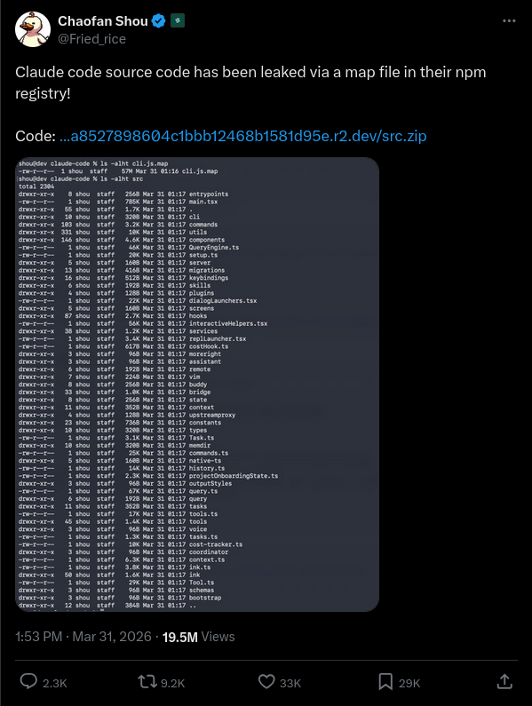
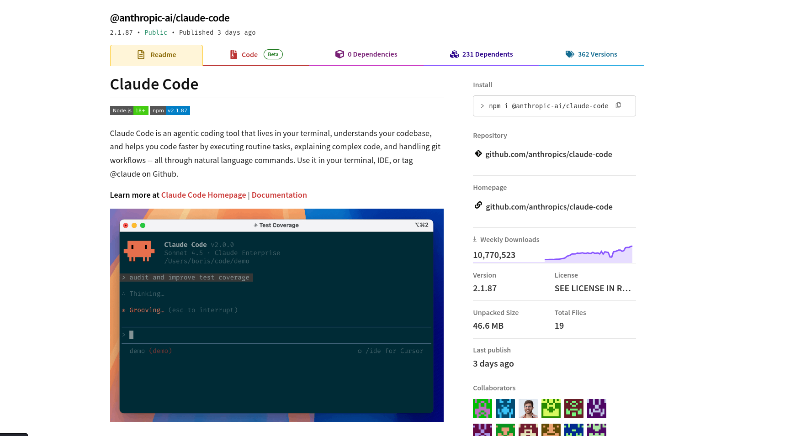

# Claude Code Source Leak via npm Sourcemap

This repository archives and documents a source leak of Claude Code that was exposed through a sourcemap file published to npm.

## What happened
On March 31, 2026, Chaofan Shou (@Fried_rice) reported that the published Claude Code package included a sourcemap containing original source files in `sourcesContent`.

- Original post: https://x.com/Fried_rice/status/2038894956459290963

[](https://x.com/Fried_rice/status/2038894956459290963)

## Why this is possible
A sourcemap can include full source text. If `.map` files are shipped to npm without proper exclusion, original code can be reconstructed.

Example:

```json
{
  "version": 3,
  "sources": ["../src/main.tsx", "../src/tools/BashTool.ts"],
  "sourcesContent": ["/* original source */", "/* original source */"],
  "mappings": "..."
}
```

[](assets/claude-npm-img.png)

## What is in this repo
This mirror is intended for technical analysis and documentation of the exposed codebase, including:

- CLI architecture
- Tooling and agent orchestration
- Bridge/remote-control internals
- Other internal modules that were not meant to be public

Main structure:

```text
src/
  main.tsx
  QueryEngine.ts
  Tool.ts
  tools/
  services/
  coordinator/
  bridge/
  buddy/
```

## Run locally
Requirements:

- Bun or Node.js
- npm

Commands:

```bash
git clone <repo-url>
cd ai-code
npm install
npm run build
node dist/main.js
```

## Disclaimer
- This is not an official Anthropic repository.
- I did not create the leak.
- Original code ownership remains with Anthropic PBC.
- Shared for research, educational, and archival purposes.

## Credits
- Discovery: Chaofan Shou (@Fried_rice)
- Source post: https://x.com/Fried_rice/status/2038894956459290963
